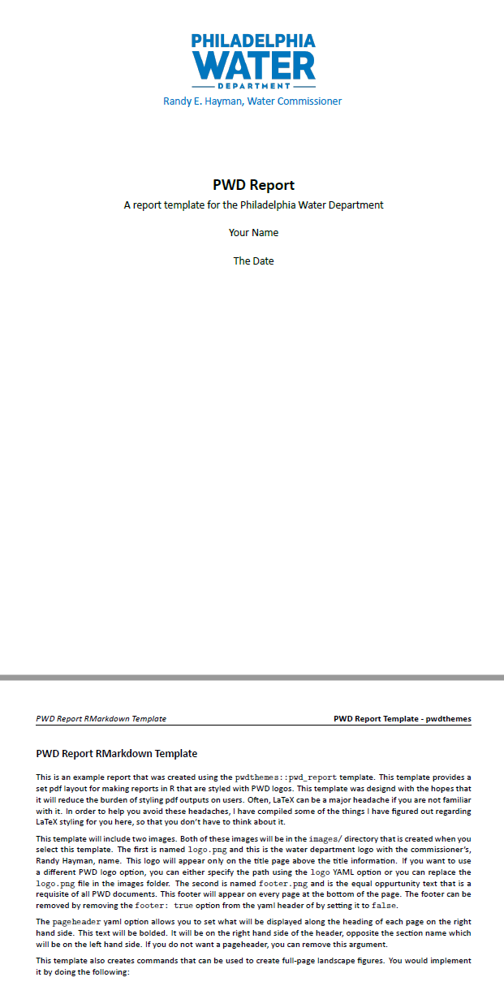
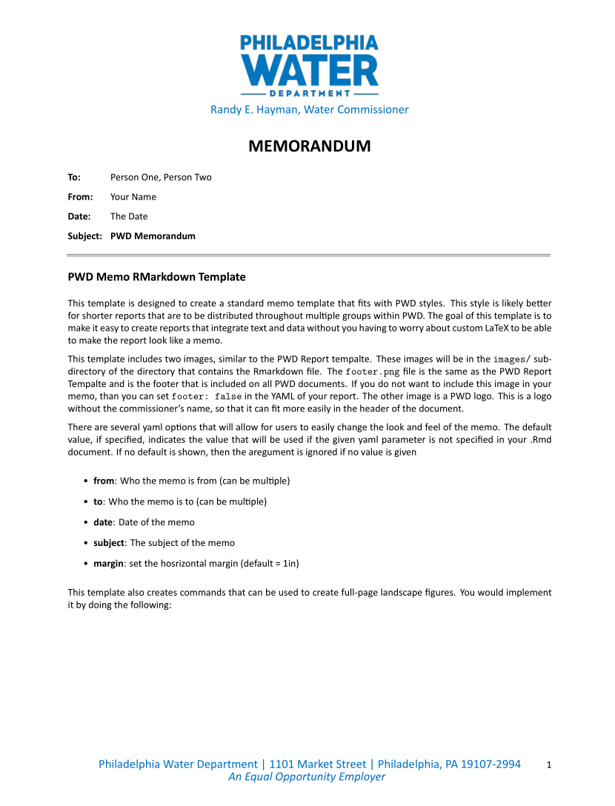
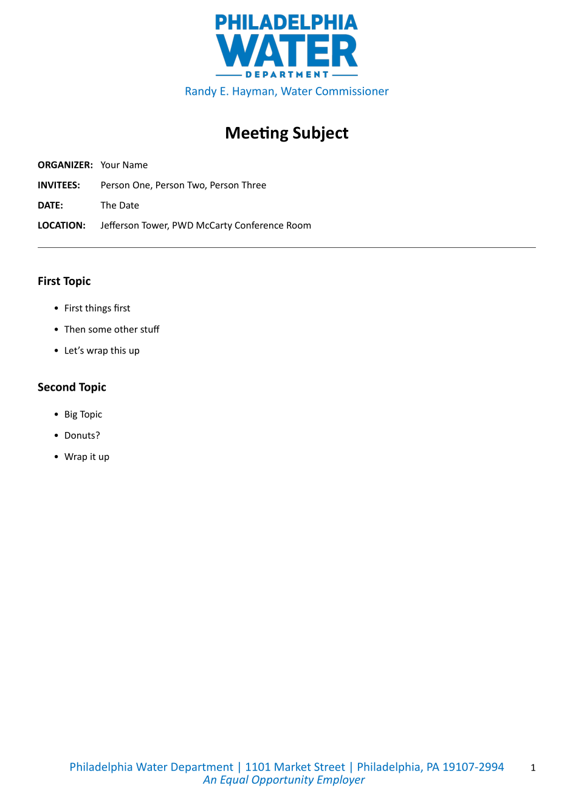

<!-- README.md is generated from README.Rmd. Please edit that file -->

# pwdthemes 

<!-- badges: start -->

<!-- badges: end -->

The goal of `pwdthemes` is to provide easy to use theme options for
employees of the Philadelphia Water Department within R and Rmarkdown.
This package provides color and fill options for `ggplot2` figures. It
also provides rmarkdown templates that will allow people to easy produce
Rmarkdown reports with PWD branding on them.

## Installation

If you are within the PWD network, you can install the released version
of pwdthemes from [PWD’s Internal Package
Directory](http://pwdrstudio/bls-cran/) with:

``` r
install.packages("pwdthemes", repos = "http://pwdrstudio/bls-cran/")
```

And the development version from [GitHub](https://github.com/) with:

``` r
# install.packages("devtools")
devtools::install_github("tbradley1013/pwdthemes")
```

**NOTE: you will have to have
[RTools](https://cran.r-project.org/bin/windows/Rtools/) installed in
order to install this package using either `install.packages` or
`install_github` methods**

## `ggplot2` theme

This package provides a custom `ggplot2` theme with the function
`theme_pwd`. This function applies font and style options that are based
on the PWD styleguide. There were not any definite figure style
recommendations, other than the title font, so I made some decisions
about style. Please feel free to suggest any changes that you think
would look good.

``` r
library(pwdthemes)
library(ggplot2)
library(dplyr)
library(ggridges)
library(patchwork)
```

``` r
bw <- ggplot(mtcars, aes(mpg, hp)) + 
  geom_point() + 
  labs(
    title = "theme_bw",
    subtitle = "mtcars dataset with Calibri font",
    caption = "A really important caption"
  ) +
  theme_bw(base_family = "Calibri") 

pwd <- ggplot(mtcars, aes(mpg, hp)) + 
  geom_point() + 
  labs(
    title = "theme_pwd",
    subtitle = "mtcars dataset with Calibri font",
    caption = "A really important caption"
  ) +
  theme_pwd()

bw + pwd
```


### Fonts

This package provides two different fonts for use with `theme_pwd`. By
default, the Calibri font will be used if it is available on your
computer. If it is not available, then the `ggplot2` font will be used.
Two other packages, Open Sans and Public Sans, are shipped with this
package. These packages can be installed with the `import_open_sans` and
`import_public_sans` functions, respectively. It is worth noting, that
these likely will need to be installed on your computer, and the
directory of the fonts to be installed will be displayed when you use
these functions. You can then specify either of these two fonts as the
`base_family` option in `theme_pwd`.

``` r
p <- ggplot(mtcars, aes(mpg, hp)) + 
  geom_point()

cal <- p + 
  labs(
    title = "Calibri",
    subtitle = "mtcars dataset with Calibri font",
    caption = "A really important caption"
  ) +
  theme_pwd()

os <- p + 
  labs(
    title = "Open Sans",
    subtitle = "mtcars dataset with Open Sans font",
    caption = "A really important caption"
  ) +
  theme_pwd(base_family = "Open Sans")

ps <- p + 
  labs(
    title = "Public Sans",
    subtitle = "mtcars dataset with Public Sans font",
    caption = "A really important caption"
  ) +
  theme_pwd(base_family = "Public Sans")

cal + os + ps + plot_layout(ncol = 1)
```


### PWD default fill and color

When `pwdthemes` is loaded, the default `ggplot2` color and scale values
are updated to reflect PWD color palettes. If you do not want this, you
can easily undo it by calling `undo_pwd_geoms()`. To reapply it after
undoing it, call `pwd_geoms()`.

### Palettes and `ggplot2` scales

This package provides functions that allow you to easily add PWD
palettes to `ggplot2` figures. These can be added using the
`scale_color_pwd` and `scale_fill_pwd` functions depending on whether
you are using the color or fill aesthetic. The palettes provided with
these functions are based on the [PWD
Styleguide](http://waternet/news/The_New_Philadelphia_Water_Brand/PWD_StyleGuidelines.pdf).
The available palettes are shown in the table below.

| Palette           | Default n | Colors                                                                                                                                                                                                                                                                                           |
| ----------------- | --------- | ------------------------------------------------------------------------------------------------------------------------------------------------------------------------------------------------------------------------------------------------------------------------------------------------ |
| main              | 7         | Blue (\#0078C8), Persian Green (\#00B388), Cerulean (\#00B5E2), Resolution Blue (\#001A70), Pear (\#DBE442), Ziggurat (\#B8DDE1), Botticelli (\#C6DAE7)                                                                                                                                          |
| main\_dark        | 4         | Blue (\#0078C8), Persian Green (\#00B388), Cerulean (\#00B5E2), Resolution Blue (\#001A70)                                                                                                                                                                                                       |
| main\_light       | 4         | Blue (\#0078C8), Pear (\#DBE442), Ziggurat (\#B8DDE1), Botticelli (\#C6DAE7)                                                                                                                                                                                                                     |
| highlights        | 6         | Tango (\#F37720), Burnt Sienna (\#F26C51), Blue Marguerite (\#7474C1), Grandis (\#FDD086), Zinnwaldite (\#ECC382), Gray Suit (\#C6C4D2)                                                                                                                                                          |
| highlights\_dark  | 3         | Tango (\#F37720), Burnt Sienna (\#F26C51), Blue Marguerite (\#7474C1)                                                                                                                                                                                                                            |
| highlights\_light | 3         | Grandis (\#FDD086), Zinnwaldite (\#ECC382), Gray Suit (\#C6C4D2)                                                                                                                                                                                                                                 |
| map               | 4         | Muddy Waters (\#B9975B), Trendy Green (\#76881D), Primrose (\#F1EB9C), Pine Glade (\#BFCC80)                                                                                                                                                                                                     |
| map\_dark         | 2         | Muddy Waters (\#B9975B), Trendy Green (\#76881D)                                                                                                                                                                                                                                                 |
| map\_light        | 2         | Primrose (\#F1EB9C), Pine Glade (\#BFCC80)                                                                                                                                                                                                                                                       |
| dark              | 7         | Blue (\#0078C8), Persian Green (\#00B388), Cerulean (\#00B5E2), Resolution Blue (\#001A70), Tango (\#F37720), Burnt Sienna (\#F26C51), Blue Marguerite (\#7474C1)                                                                                                                                |
| light             | 7         | Blue (\#0078C8), Pear (\#DBE442), Ziggurat (\#B8DDE1), Botticelli (\#C6DAE7), Grandis (\#FDD086), Zinnwaldite (\#ECC382), Gray Suit (\#C6C4D2)                                                                                                                                                   |
| full              | 13        | Blue (\#0078C8), Persian Green (\#00B388), Cerulean (\#00B5E2), Resolution Blue (\#001A70), Pear (\#DBE442), Ziggurat (\#B8DDE1), Botticelli (\#C6DAE7), Tango (\#F37720), Burnt Sienna (\#F26C51), Blue Marguerite (\#7474C1), Grandis (\#FDD086), Zinnwaldite (\#ECC382), Gray Suit (\#C6C4D2) |

A few of them will be demonstrated here:

``` r
large_diamonds <- diamonds %>% 
  filter(carat > 2.2)

pc <- ggplot(large_diamonds, aes(price, carat, color = cut)) + 
  geom_point() + 
  theme_pwd()

pf <- ggplot(large_diamonds, aes(price, cut, fill = cut)) + 
  geom_density_ridges() + 
  theme_pwd()
```

#### Main

``` r
pc_main <- pc + scale_color_pwd("main")
pf_main <- pf + scale_fill_pwd("main")

pc_main + pf_main
```


#### Main Dark

``` r
pc_main_d <- pc + scale_color_pwd("main_dark")
pf_main_d <- pf + scale_fill_pwd("main_dark")

pc_main_d + pf_main_d
```


#### Dark

``` r
pc_dark <- pc + scale_color_pwd("dark")
pf_dark <- pf + scale_fill_pwd("dark")

pc_dark + pf_dark
```


#### View PWD Palettes

You can view what the palette you choose will look like for any given
number of variables using the `view_pwd_palette` function. You simply
have to pass the palette you are interested as a character string and
the number of levels of color required. If you do not pass a number to
the n argument, it will show you the default number of colors for a
given palette

``` r
view_pwd_palette("dark")
```


``` r
view_pwd_palette("dark", 4)
```


## RMarkdown Templates

This package provides several Rmarkdown template. These templates will
allow for users to easily create branded PWD documents to share easily.
This will hopefully reduce the amount of time and headache that is spent
trying to create LaTeX styles for reports that may be preventing people
from embracing Rmarkdown for writing their reports. Please note that
these templates are not approved by public affairs, so please consult
your supervisor before using these templates to share reports outside of
the department. The templates that are included with this package are:

  - **PWD Report** - This template creates a report document with a
    standalone title page, custom page headers and PWD logos. This
    template is great for any kind of report that you may be writing for
    PWD.
  - **PWD Memo** - This template creates a interoffice memo with the
    customary memo header. This will allow you to easily integrate any R
    code, simple or complex, into a memo that can be distributed
    throughout the department.
  - **PWD Meeting Agenda** - This template will allow users to create
    meeting notes with a custom header.

### PWD Report

<center>



</center>

### PWD Memo



### PWD Meeting Agenda


